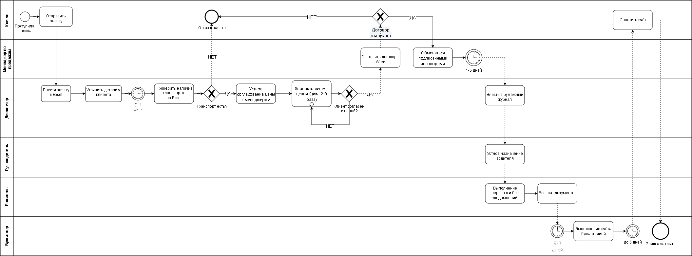

# AS-IS: Процесс обработки и выполнения заявки. Компания «ГрузЛогистик»

---

## 🛠️ Сведения о работе
* **Автор:** Голубев Дмитрий Евгеньевич (студент группы 51 ФЗ-м)
* **Дата создания:**  Август 2026 г.
* **Инструмент моделирования:** draw.io (app.diagrams.net)
* **Форматы экспорта:** PNG, PDF (с разрешением от 150 DPI)

---

## 👥 Участники процесса (Lanes)
Диаграмма разбита на 4 функциональные дорожки, полностью охватывающие зоны ответственности:
1. **Клиент** — инициатор запроса, принимает коммерческое предложение, подписывает договор и производит оплату.
2. **Диспетчер** — проверяет наличие свободного транспорта, назначает водителя и распределяет маршрутные листы, закрывает заявку и выставляет счет.
3. **Менеджер по продажам** — рассчитывает стоимость перевозки, формирует и отправляет коммерческое предложение, готовит договор.
4. **Водитель** — выполняет физическую погрузку, перевозку и выгрузку груза, а также фиксирует закрытие заявки в системе.

---

## 🔄 Логика и структура процесса

### 1. Этап инициации и проверки ресурсов
* **Начальное событие:** Тонкий круг «Поступление заявки» (в зоне Диспетчера).
* Диспетчер выполняет задачу *«Проверить наличие транспорта»*.
* **Шлюз XOR («Транспорт доступен?»):**
  * **НЕТ:** Процесс завершается скомпрометированным событием *«Отказ из-за отсутствия транспорта»*.
  * **ДА:** Управление переходит к Менеджеру по продажам.

### 2. Расчет стоимости и согласование с клиентом
* Менеджер по продажам выполняет задачу *«Рассчитать стоимость перевозки»* и передает результат через задачу *«Отправить коммерческое предложение клиенту»* (поток сообщений к Клиенту).
* Клиент получает предложение и запускается **Событие-таймер** *«Ожидание ответа клиента»*.
* По истечении времени или по факту ответа проверяется **Шлюз XOR («Клиент принимает цену?»)**:
  * **НЕТ:** Процесс завершается событием *«Отказ клиента от цены»*.
  * **ДА:** Менеджер переходит к задаче *«Подготовить договор и направить клиенту»* (поток сообщений к Клиенту).

### 3. Заключение договора и логистика
* Клиент получает договор и выполняет задачу *«Подписать договор»*.
* **Шлюз XOR («Договор подписан?»):**
  * **НЕТ:** Сделка прерывается (*«Срыв сделки»*).
  * **ДА:** Диспетчер выполняет задачу *«Назначить водителя и передать маршрутный лист»*.
* Водитель берет в работу задачу *«Выполнить погрузку, перевозку, выгрузку»*, после чего следует задача *«Закрыть заявку в системе»*.

### 4. Завершение и расчеты
* Диспетчер выполняет задачу *«Проверить закрытие и выставить счет»* (поток сообщений к Клиенту).
* Клиент осуществляет задачу *«Оплатить счет»*.
* **Конечное успешное событие:** *«Заявка выполнена успешно»*.

---

## 🗂️ Легенда элементов BPMN

| Описание на схеме | Назначение |
| :--- | :--- |
| Тонкий круг | Начальное событие процесса («Поступление заявки») |
| Жирный/двойной круг | Конечное событие (успех или различные виды отказов/срывов) |
| Прямоугольник со скругленными углами | Задача (выполнение конкретного действия участником) |
| Ромб с крестиком внутри | Исключающий шлюз XOR (развилки по условиям «Да/Нет») |
| Значок часов на событии | Событие-таймер («Ожидание ответа клиента») |
| Пунктирная стрелка | Поток сообщений между пулами/участниками (документы, КП, счета) |

---
