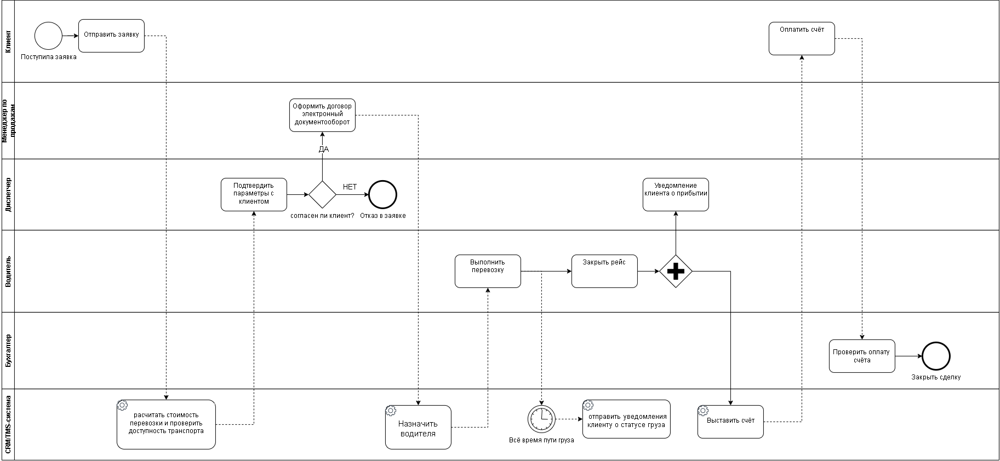

# Задание 4: Построение BPMN-диаграммы TO-BE

Оптимизированный процесс обработки и выполнения заявки для компании **«ГрузЛогистик»**.

---

## 📋 Описание проекта

В данном репозитории представлена оптимизированная процессная модель **TO-BE**, нацеленная на устранение потерь (Lean), минимизацию ручных операций и автоматизацию ключевых этапов логистической цепочки компании «ГрузЛогистик».

---

## ⚙️ Ключевые требования и их реализация в TO-BE

| Требование | Реализация в процессе TO-BE |
| :--- | :--- |
| **Новые участники** | Добавлена выделенная дорожка **«CRM/TMS-система»** для автоматизированных системных задач. |
| **Автоматические задачи** | Реализовано **более 3 задач**, выполняемых системой автоматически (выделены иконкой ⚙️): 1. *Рассчитать стоимость перевозки и проверить доступность транспорта* 2. *Назначить водителя* 3. *Отправить уведомление клиенту о статусе груза* 4. *Выставить счёт* |
| **Параллельный шлюз (AND)** | Добавлен параллельный шлюз (`+`) при закрытии рейса для одновременного уведомления клиента о прибытии и автоматического выставления счёта. |
| **Событие-таймер** | Интегрировано событие-таймер (`⏱️`), обеспечивающее автоматическое периодическое отслеживание пути груза и уведомление клиента. |
| **Сокращение шагов** | Исключены дублирующие ручные операции за счет сквозного электронного документооборота и автоматизации расчетов. |
| **Исключение потерь (Lean)** | Устранены задержки передачи данных между отделами, ручной просчет логистики и человеческий фактор при выставлении счетов. |

---

## 📊 Визуализация процесса (BPMN TO-BE)

Ниже представлена схема оптимизированного процесса:

*(Если изображение не отображается, вы можете найти его в файле `33333333333.png` в корне репозитория).*

---

## 🗂️ Легенда автоматических задач и элементов

* **⚙️ Системная задача (Service Task):** Задача, выполняемая CRM/TMS-системой без участия человека.
* **⏱️ Событие-таймер (Timer Intermediate Event):** Автоматическое отслеживание временных интервалов и отправка регулярных статусных уведомлений.
* **➕ Параллельный шлюз (Parallel Gateway):** Разделение потока управления для параллельного выполнения независимых задач (уведомления и финансовые операции).

---

## 📌 Информация о документе

* **Название:** TO-BE: Оптимизированный процесс обработки и выполнения заявки
* **Компания:** ООО «ГрузЛогистик»
* **Формат экспорта:** PNG (разрешение более 150 DPI)
