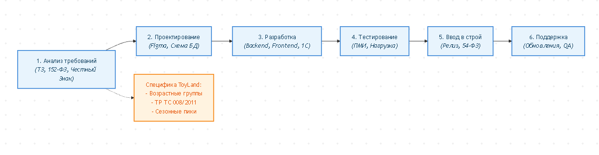

# Задание 1: Жизненный цикл и технический проект

Выполнение комплексного практического задания по проектированию информационной системы интернет-портала по продаже детских игрушек. Задание состоит из двух частей: выбор и описание каскадной модели жизненного цикла (Waterfall) с учетом специфики e-commerce для детей, а также разработка верхнеуровневого Технического проекта по стандартам проектирования ИС.

---

## 🔄 Часть 1. Жизненный цикл разработки ПО (Каскадная модель / Waterfall)

Для проекта интернет-портала по продаже детских игрушек («ToyLand») выбрана **классическая каскадная модель (Waterfall)**, так как требования к безопасности детских товаров, интеграции с маркировкой «Честный Знак», платежными шлюзами и складскими системами жестко регламентированы на старте.

### Графическая схема ЖЦ (Waterfall)

### Детальное описание этапов с учетом специфики интернет-магазина детских игрушек:

1. **Инициация и анализ требований (Requirements Analysis):**
   * *Специфика:* Сбор требований к каталогу детских товаров (возрастные категории: 0-3 года, 3-6 лет, школьники; фильтрация по безопасности материалов, экологичности, брендам). Учет требований законодательства РФ (маркировка детских товаров «Честный Знак», сертификаты соответствия ГОСТ/ТР ТС 008/2011 «О безопасности игрушек»).
   * *Артефакт:* Техническое задание (ТЗ), SRS-спецификация.

2. **Проектирование (Design & Architecture):**
   * *Специфика:* Разработка яркого, интуитивного UI/UX дизайна (психология восприятия родителей и детей, адаптивная верстка под мобильные устройства, так как до 75% трафика e-commerce — с телефонов). Проектирование базы данных для сложной иерархии категорий игрушек, остатков на удаленных складах и персональных рекомендаций.
   * *Артефакт:* Архитектурная схема, макеты в Figma, схема реляционной БД.

3. **Разработка (Implementation / Coding):**
   * *Специфика:* Написание кода серверной части (Backend) и клиентской части (Frontend). Интеграция с платежными системами (СБП, банковские карты), модулями доставки (СДЭК, Почта России), системами товарного учета (1С:УТ / МойСклад) и шлюзом проверки маркировки «Честный Знак».
   * *Артефакт:* Исходный код информационной системы, готовый к развертыванию.

4. **Тестирование (Testing & Quality Assurance):**
   * *Специфика:* Проведение функционального, интеграционного, нагрузочного (расчет на пиковые сезоны распродаж: Новый год, Черная пятница, 1 сентября) и безопасности тестирования (защита персональных данных покупателей по 152-ФЗ).
   * *Артефакт:* Программа и методика испытаний (ПМИ), отчеты об ошибках, сертификат безопасности.

5. **Ввод в эксплуатацию (Deployment & Release):**
   * *Специфика:* Развертывание системы на продуктовых серверах, перенос каталога игрушек, подключение фискальных регистраторов (54-ФЗ), обучение сотрудников службы поддержки и контент-менеджеров работе с админ-панелью.
   * *Артефакт:* Акт ввода в промышленную эксплуатацию.

6. **Сопровождение (Maintenance & Support):**
   * *Специфика:* Мониторинг работоспособности портала, оперативное устранение дефектов, регулярное резервное копирование данных, обновление ассортиментной матрицы и выпуск сезонных обновлений (акции, праздничные баннеры).
   * *Артефакт:* Журнал инцидентов, тикеты техподдержки.

---

## 📋 Часть 2. Технический проект для ИС «Интернет-портал «ToyLand»»

---

### 1. Пояснительная записка
* **Наименование системы:** Автоматизированная информационная система интернет-портал по продаже детских игрушек «ToyLand» (далее — АИС «ToyLand»).
* **Назначение:** Автоматизация процессов розничной онлайн-торговли детскими товарами, управление каталогом, обработка заказов, интеграция со складом и службами доставки.
* **Цели создания:** 
  * Создание единого омниканального пространства для покупки сертифицированных детских товаров.
  * Автоматический контроль возрастных ограничений и безопасности продукции.
  * Увеличение конверсии интернет-магазина и сокращение времени обработки заказа до ≤ 10 минут.

---

### 2. Функциональная и организационная структура системы

#### 2.1. Организационная структура (Роли пользователей)
* **Покупатель (Родитель / Ребенок):** Регистрация, просмотр каталога, подбор игрушек по возрасту/полу, оформление заказа, оплата, отслеживание доставки.
* **Контент-менеджер:** Ведение карточек товаров, загрузка сертификатов соответствия, управление баннерами и акциями.
* **Менеджер по продажам / Оператор:** Обработка входящих заказов, связь с клиентами, контроль статусов оплаты и отгрузки.
* **Кладовщик / Работник склада:** Сборка заказов по сборочным листам, сканирование кодов маркировки «Честный Знак», передача в службу доставки.
* **Администратор системы:** Управление правами доступа (RBAC), мониторинг серверной инфраструктуры, настройка интеграций.

#### 2.2. Функциональная структура (Подсистемы)
1. **Витрина и каталог (Front-office):** Поиск, фасетная фильтрация по возрасту, полу, бренду, материалу и безопасности.
2. **Личный кабинет и программа лояльности:** История покупок, бонусные баллы, трекинг статусов заказа.
3. **Модуль оформления заказа (Checkout) и Оплаты:** Интеграция с эквайрингом и СБП.
4. **Административно-управленческий модуль (Back-office):** Управление товарными остатками, ценообразованием и аналитикой продаж.
5. **Интеграционный модуль:** Синхронизация с 1С, логистическими службами и системой «Честный Знак».

---

### 3. Постановка задач и алгоритмы решения

#### 3.1. Задача автоматического подбора игрушек по возрасту и безопасности
* **Суть задачи:** Фильтрация каталога товаров на основе указанного возраста ребенка и проверка наличия обязательных сертификатов безопасности.
* **Алгоритм решения:**
  1. Пользователь в фильтре указывает возраст ребенка (например, «3 года»).
  2. Система запрашивает из базы данных товары, у которых диапазон `min_age <= 3` и `max_age >= 3`.
  3. Фильтрует выдачу по наличию активного сертификата соответствия в поле `certificate_status = 'Valid'`.
  4. Сортирует результат по популярности и возвращает клиенту.

#### 3.2. Задача контроля остатков и резервирования при оформлении заказа
* **Суть задачи:** Предотвращение продажи отсутствующих на складе товаров в условиях высокой конкуренции (Flash-сейлы).
* **Алгоритм решения:**
  1. При клике на «Оформить заказ» система инициирует транзакцию в базе данных.
  2. Проверяет актуальный остаток товара (`stock_quantity >= requested_qty`).
  3. При положительном ответе временно резервирует товар на 15 минут (`status = 'Reserved'`).
  4. После успешного подтверждения оплаты статус переводится в `Sold`, а остаток списывается окончательно.

---

### 4. Мероприятия по подготовке объекта к внедрению системы
1. **Организационные мероприятия:**
   * Издание приказа руководства компании о внедрении АИС «ToyLand» и назначении ответственных лиц.
   * Разработка и утверждение должностных инструкций для операторов, контент-менеджеров и кладовщиков.
2. **Технические мероприятия:**
   * Развертывание отказоустойчивой серверной инфраструктуры (или облачного кластера с поддержкой SSL-сертификатов).
   * Интеграция онлайн-касс и фискальных накопителей в соответствии с 54-ФЗ.
3. **Кадровые мероприятия (Обучение):**
   * Проведение обучающих семинаров и практикумов для сотрудников склада по работе с терминалами сбора данных (ТСД) и сканированию маркировки.
   * Обучение менеджеров отдела продаж работе с интерфейсом обработки заказов в CRM/Back-office.

---

## 📌 Информация о документе
* **Тема:** Жизненный цикл ПО (Waterfall) и Технический проект ИС
* **Предметная область:** Интернет-портал по продаже детских игрушек («ToyLand»)
