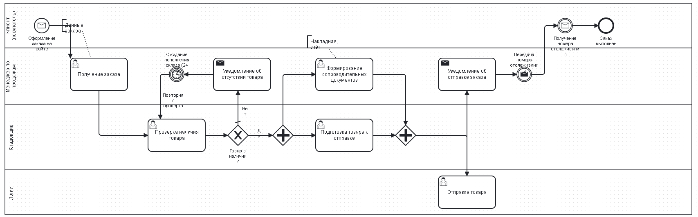

# Отчет по бизнес-процессу: «Заказ товара онлайн»

## 1. Общее описание процесса
Бизнес-процесс **«Заказ товара онлайн»** описывает сквозное взаимодействие клиента с ключевыми подразделениями интернет-магазина с момента оформления покупки на сайте до получения трек-номера отслеживания и завершения заказа.

---

## 2. Ответственные должности (Пул дорожек)

| Должность / Роль | Зона ответственности и выполняемые действия |
| :--- | :--- |
| **Клиент (покупатель)** | Инициация процесса, ожидание и получение уведомлений, получение номера отслеживания. |
| **Менеджер по продажам** | Получение заказа, обработка ситуации отсутствия товара на складе, формирование сопроводительных документов, передача номера отслеживания клиенту. |
| **Кладовщик** | Проверка наличия товара на складе, развилка по наличию, параллельное разделение и слияние потоков, подготовка товара к отправке. |
| **Логист** | Фактическая отправка товара клиенту. |

---

## 3. Использованные элементы BPMN
* **Последовательности шагов:** Направленные стрелки, определяющие строгий порядок выполнения задач в процессе.
* **Параллельное выполнение:** Используется значок «плюс» внутри ромба для разветвления процесса на два параллельных потока и их последующего слияния.
* **Ветвления и объединения:** Развилка с крестиком для проверки наличия товара на складе (условное ветвление «Товар в наличии?» — ветки «Да» / «Нет»).
* **Информационные узлы и уведомления:** Сообщения для обмена данными между участниками, а также ассоциации с документами.
* **Условные ветвления, циклы, таймеры:** Таймер ожидания пополнения склада на 24 часа с организацией цикла.

---

## 4. Ответы на контрольные вопросы

### 1. Какие шаги выполняются последовательно?
* Оформление заказа на сайте (Клиент) → Получение заказа (Менеджер по продажам).
* Получение заказа → Проверка наличия товара (Кладовщик).
* При отсутствии товара: Проверка наличия → Развилка «Нет» → Уведомление об отсутствии товара → Ожидание пополнения склада (24ч) → Повторная проверка.
* После успешной подготовки и слияния потоков: Передача номера отслеживания → Получение номера отслеживания клиентом → Заказ выполнен (Конец).

### 2. Какие шаги выполняются параллельно?
* **Ветвь 1 (Менеджер):** Формирование сопроводительных документов (накладная, счет).
* **Ветвь 2 (Кладовщик):** Подготовка товара к отправке.

### 3. Какие условия влияют на подготовку товара?
Главным условием, определяющим дальнейший ход подготовки товара, является **наличие товара на складе**, которое проверяется кладовщиком:
* **Если товар в наличии («Да»):** Процесс переходит к параллельному этапу формирования документов и подготовки товара к отправке.
* **Если товара нет («Нет»):** Запускается ветка обработки: клиенту отправляется уведомление об отсутствии товара, включается таймер ожидания пополнения склада, после чего выполняется повторная проверка наличия.

### 4. Какое уведомление отправляется клиенту после отправки?
После того как логист осуществляет отправку товара, клиентам направляется **«Уведомление об отправке заказа»**, содержащее **номер отслеживания**, с помощью которого клиент может отслеживать статус доставки.

---

